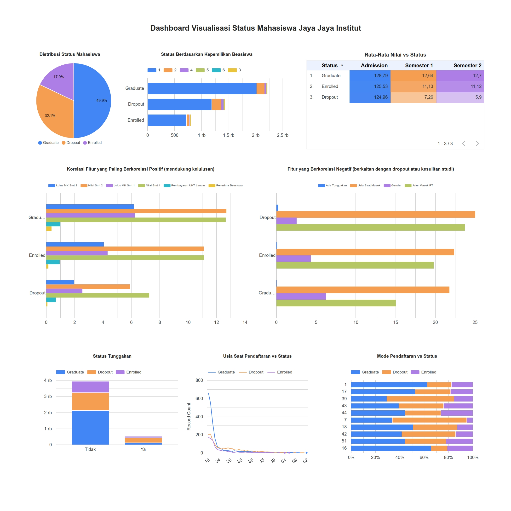

# Submission Akhir: Menyelesaikan Permasalahan Institusi Pendidikan

## Business Understanding

Dropout mahasiswa merupakan salah satu tantangan utama dalam dunia pendidikan tinggi. Fenomena ini merujuk pada kondisi ketika mahasiswa memutuskan untuk tidak melanjutkan studi sebelum menyelesaikan programnya. Selain berdampak pada individu, tingkat dropout yang tinggi juga dapat mencerminkan adanya permasalahan struktural dalam institusi pendidikan.

Jaya Jaya Institut adalah sebuah institusi pendidikan tinggi swasta yang telah berdiri sejak tahun 2000 dan memiliki ribuan mahasiswa aktif dari berbagai jurusan. Dalam beberapa tahun terakhir, pihak manajemen menyadari adanya peningkatan jumlah mahasiswa yang dropout, serta cukup banyak mahasiswa yang belum menyelesaikan studi tepat waktu (status "Enrolled" lebih lama dari seharusnya).

Situasi ini menimbulkan kekhawatiran karena dapat berdampak pada reputasi institusi, efisiensi operasional, dan performa akreditasi. Untuk mengantisipasi hal tersebut, manajemen Jaya Jaya Institut ingin memahami faktor-faktor apa saja yang berkontribusi terhadap status akhir mahasiswa, baik itu Dropout, Graduate, atau masih Enrolled.


### Permasalahan Bisnis

- Mengapa sebagian mahasiswa mengalami dropout atau belum lulus tepat waktu di Jaya Jaya Institut?

- Faktor apa saja yang paling memengaruhi status akhir mahasiswa (Dropout, Enrolled, Graduate)?

- Bagaimana institusi dapat memantau dan memitigasi risiko mahasiswa dropout secara preventif?

- Apa strategi berbasis data yang bisa diterapkan untuk meningkatkan tingkat kelulusan dan retensi mahasiswa?


### Cakupan Proyek

Untuk menjawab permasalahan di atas, proyek ini meliputi:

- Melakukan eksplorasi dan analisis data mahasiswa dari Jaya Jaya Institut untuk menemukan pola dan karakteristik mahasiswa berdasarkan status akhir.

- Mengidentifikasi fitur-fitur penting seperti nilai semester, umur masuk, status keuangan, beasiswa, dan lainnya yang berkorelasi dengan kemungkinan mahasiswa dropout.

- Membangun model machine learning untuk memprediksi status mahasiswa berdasarkan data historis.

- Menyusun dashboard interaktif berbasis Streamlit atau Looker Studio untuk mempermudah manajemen memantau metrik kunci terkait retensi mahasiswa dan pengambilan keputusan strategis.


## Proyek Data Science

Adapun proses EDA sampai dengan melakukan training model dan save model dilakukan di Google Colab yang file notebooknya juga tersedia di sini.

```
notebook.ipynb
```

Model yang sudah dilatih telah disimpan di dalam folder Model, berikut juga Labelnya.

```
model/random_forest_model.pkl
model/label_encoder.pkl
```

### Sumber Data 
Dataset yang digunakan untuk data train disediakan oleh tim Jaya Jaya Institut (fiktif dari Dicoding).

```
https://raw.githubusercontent.com/dicodingacademy/dicoding_dataset/main/students_performance/data.csv
```

### Pemilihan Fitur 
Pada notebook dapat dilihat bahwa pemilihan fitur dari dataset berdasarkan hasil EDA, yaitu :

| No  | Fitur                               | Penjelasan                                                                   |
| :-: | ----------------------------------- | ---------------------------------------------------------------------------- |
| 1   | `Curricular_units_2nd_sem_approved` | Jumlah unit kurikulum yang diselesaikan mahasiswa di semester kedua.         |
| 2   | `Curricular_units_2nd_sem_grade`    | Nilai rata-rata mata kuliah yang diambil di semester kedua.                  |
| 3   | `Curricular_units_1st_sem_approved` | Jumlah unit kurikulum yang diselesaikan mahasiswa di semester pertama.         |
| 4   | `Curricular_units_1st_sem_grade`    | Nilai rata-rata mata kuliah yang diambil di semester pertama.                  |
| 5   | `Tuition_fees_up_to_date`           | Status pembayaran biaya kuliah (1 jika tepat waktu, 0 jika tidak).             |
| 6   | `Scholarship_holder`                | Status kepemilikan beasiswa (1 jika memiliki, 0 jika tidak).                 |
| 7   | `Debtor`                            | Status tunggakan biaya kuliah (1 jika memiliki tunggakan, 0 jika tidak).     |
| 8   | `Age_at_enrollment`                 | Usia mahasiswa saat pertama kali mendaftar.                                  |
| 9   | `Gender`                            | Jenis kelamin mahasiswa (0 untuk Perempuan, 1 untuk Laki-laki - berdasarkan encoding). |
| 10  | `Application_mode`                  | Mode pendaftaran mahasiswa ke institusi (misalnya, jalur PMDK, mandiri, dll.). |
| 11  | `Status`                            | Status akhir mahasiswa (Graduate, Enrolled, atau Dropout) - **Target**.      |

### Setup Environment

```bash
python -m pip install --user -r requirements.txt
```

### Testing - Jalankan Prediksi

```bash
python -m streamlit run app.py
```

Setelah itu akses aplikasi via browser

```bash
http://localhost:8501/
```

### Hasil Prediksi

<video width="640" controls>
  <source src="masjumabduljabbar-video.webm" type="video/webm">
  Your browser does not support the video tag.
</video>


---

## Business Dashboard

Dashboard ini akan menampilkan visualisasi kunci dari analisis data siswa untuk membantu manajemen institusi pendidikan mengambil keputusan. Visualisasi yang ditampilkan mencakup:

1.  **Distribusi Status Mahasiswa:** Melihat proporsi mahasiswa yang Graduate, Enrolled, dan Dropout.
2.  **Status Berdasarkan Kepemilikan Beasiswa:** Membandingkan tingkat kelulusan antara mahasiswa penerima dan non-penerima beasiswa.
3.  **Rata-Rata Nilai vs Status:** Menampilkan perbandingan nilai masuk, nilai semester 1, dan nilai semester 2 berdasarkan status akhir mahasiswa.
4.  **Korelasi Fitur yang Paling Berkorelasi Positif (mendukung kelulusan):** Menunjukkan faktor-faktor numerik yang paling berpengaruh terhadap status kelulusan.
5.  **Fitur yang Berkorelasi Negatif (berkaitan dengan dropout atau kesulitan studi):** Menunjukkan faktor-faktor numerik yang paling berpengaruh terhadap status dropout.
6.  **Analisa Status Tunggakan:** Memvisualisasikan hubungan antara status pembayaran UKT (punya tunggakan atau tidak) dengan kemungkinan Dropout.
7.  **Analisa Usia Saat Pendaftaran vs Status:** Menampilkan tren status mahasiswa berdasarkan usia saat pertama mendaftar.
8.  **Analisa Mode Pendaftaran vs Status:** Melihat dampak berbagai mode pendaftaran terhadap hasil akhir studi.

Dashboard ini bertujuan memberikan insight cepat dan visual mengenai faktor-faktor penentu keberhasilan dan potensi risiko dropout siswa.

🔗 [Klik untuk Lihat Dashboard di Looker Studio](https://lookerstudio.google.com/reporting/0f6a7c23-f2a2-421a-959b-f1201aefef91/page/CI6KF)





## Conclusion

Berdasarkan hasil eksplorasi data (EDA), pemodelan machine learning, serta pembuatan business dashboard, ditemukan bahwa sejumlah faktor berpengaruh signifikan terhadap status akhir mahasiswa di Jaya Jaya Institut.

Beberapa temuan penting meliputi:

- Mahasiswa dropout cenderung memiliki nilai akademik yang rendah, terutama pada semester awal (Semester 1 dan 2). Nilai semester menunjukkan korelasi yang cukup kuat terhadap status mahasiswa.

- Fitur-fitur seperti Debtor (utang pendidikan), usia saat masuk kuliah (Age_at_enrollment), Gender, dan Application_mode memiliki korelasi negatif dengan status, yang berarti semakin tinggi nilainya, semakin besar kemungkinan mahasiswa tidak menyelesaikan studinya.

- Mahasiswa yang tidak membayar biaya kuliah tepat waktu atau memiliki utang pendidikan memiliki risiko dropout lebih tinggi.

- Model prediksi menggunakan XGBoost memberikan performa terbaik dengan akurasi sekitar 76.7%, dan dapat membantu institusi memprediksi status mahasiswa sejak dini.

- Dashboard interaktif yang dibangun dapat membantu manajemen dan tim akademik dalam memantau indikator risiko dropout, serta mengambil tindakan preventif berdasarkan data historis dan tren.


## Rekomendasi Action Items

Untuk meningkatkan retensi dan keberhasilan studi mahasiswa di Jaya Jaya Institut, disarankan beberapa langkah strategis berikut:

**Action Item 1 - Pendampingan Akademik untuk Semester Awal**: 

Mahasiswa dengan performa rendah pada semester pertama dan kedua berisiko tinggi mengalami dropout. Program bimbingan belajar, mentoring, dan konseling akademik dapat difokuskan pada mahasiswa dengan nilai rendah sejak awal perkuliahan.

**Action Item 2 - Bantuan Keuangan dan Konseling Pembayaran**: 

Fitur Debtor menunjukkan bahwa mahasiswa dengan kesulitan membayar biaya kuliah memiliki risiko dropout yang signifikan. Institut dapat:

- Menyediakan beasiswa darurat
- Menawarkan program cicilan atau relaksasi pembayaran
- Melakukan konseling keuangan kepada mahasiswa yang berisiko

**Action Item 3 - Pemetaan Risiko Berdasarkan Profil Mahasiswa Baru**: 

Faktor usia saat masuk kuliah dan mode pendaftaran memiliki dampak terhadap kelulusan. Perlu diadakan pemetaan risiko berbasis profil masuk untuk:

- Memberi dukungan tambahan kepada mahasiswa yang masuk melalui jalur non-reguler atau lebih tua dari usia rata-rata.
- Menyesuaikan beban studi dan layanan bimbingan sesuai kebutuhan.

**Action Item 4: Penggunaan Dashboard untuk Monitoring Progres**:

Dashboard interaktif yang dibangun perlu digunakan secara berkala oleh tim akademik, bagian keuangan, dan manajemen untuk memantau:

- Mahasiswa yang berisiko tinggi dropout
- Nilai semester dan histori keuangan mahasiswa
- Efektivitas program intervensi